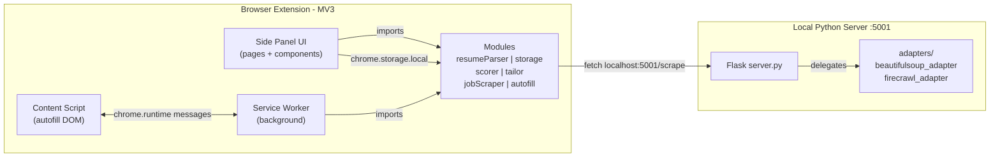

# JobBot Browser Extension -- Scaffold and First Working Slice

## Architecture




- **Primary UI**: Chrome Side Panel (`sidePanel` API) / Firefox sidebar (`sidebar_action`). Both point to the same `sidepanel/index.html`. Opens alongside job pages for autofill workflow.
- **Persistence**: All state in `chrome.storage.local` -- no external DB.
- **Scraper**: JS module calls `localhost:5001/scrape`; Flask server delegates to whichever adapter is configured. The JS side knows nothing about adapter selection.
- **AI/LLM stubs**: Scorer and tailor use keyword-overlap algorithms with clearly marked swap points.
- **Build**: Vite bundles three entry points (side panel HTML, service worker, content script) and copies `manifest.json` + icons to `dist/`.

## Directory Structure

All paths are relative to the repo root. Old Electron/Next.js files are gone; this is a clean start.

```
├── package.json                     # Vite, pdfjs-dist, mammoth, webextension-polyfill
├── vite.config.js                   # Multi-entry: sidepanel, service-worker, content
├── manifest.json                    # MV3 source manifest (copied to dist)
│
├── src/
│   ├── sidepanel/                   # --- Side Panel (main UI) ---
│   │   ├── index.html               # Shell HTML, loads app.js
│   │   ├── app.js                   # Hash router + page orchestration
│   │   ├── app.css                  # Global styles
│   │   ├── pages/
│   │   │   ├── uploadPage.js        # Resume upload view
│   │   │   ├── targetPage.js        # Company/title/filter inputs
│   │   │   ├── resultsPage.js       # Ranked job table
│   │   │   ├── detailPage.js        # Full posting + keyword gap
│   │   │   └── settingsPage.js      # User profile Q&A, server status
│   │   └── components/
│   │       ├── nav.js               # Step navigation bar
│   │       ├── resumeUpload.js      # Drag-and-drop file input
│   │       ├── companyAutocomplete.js  # Fuzzy-match company input
│   │       ├── tagInput.js          # Multi-select tag chips
│   │       ├── filterControls.js    # Salary, location, exp, remote
│   │       ├── jobTable.js          # Sortable results table
│   │       ├── detailPanel.js       # Posting body + highlighted keywords
│   │       ├── keywordGap.js        # Missing vs matched skills
│   │       └── pauseBanner.js       # "Paused -- complete manually" banner
│   │
│   ├── background/
│   │   └── service-worker.js        # Message relay, sidePanel.open trigger
│   │
│   ├── content/
│   │   └── content.js               # DOM autofill + manual-pause detection
│   │
│   ├── modules/                     # --- Core Business Logic (standalone ES modules) ---
│   │   ├── resumeParser.js          # parseResume(file) → ResumeData
│   │   ├── storage.js               # get/set/remove wrappers over chrome.storage.local
│   │   ├── jobScraper.js            # scrapeJobs(criteria) → [JobPosting]
│   │   ├── scorer.js                # scoreJob(resume, posting) → {fitScore, atsScore}
│   │   ├── tailor.js                # getTailoringAdvice / autoTailorResume
│   │   └── autofill.js              # autofillPage(tabId, resume, userProfile)
│   │
│   ├── data/
│   │   └── companies.json           # Seed list (~100 companies for autocomplete)
│   │
│   └── lib/
│       └── constants.js             # SCRAPER_URL, storage keys, version
│
├── python-server/                   # --- Local Flask Scraper ---
│   ├── server.py                    # Flask app, /scrape + /health routes
│   ├── requirements.txt             # flask, flask-cors, beautifulsoup4, requests
│   ├── config.py                    # ACTIVE_ADAPTER flag
│   ├── start_server.sh              # Unix startup
│   ├── start_server.bat             # Windows startup
│   └── adapters/
│       ├── base_adapter.py          # ABC: scrape_jobs(criteria) → list[dict]
│       ├── beautifulsoup_adapter.py # Default -- returns mock postings (stub)
│       └── firecrawl_adapter.py     # Future drop-in (raises NotImplementedError)
│
├── icons/                           # Extension icons (16/48/128 px)
│   ├── icon16.png
│   ├── icon48.png
│   └── icon128.png
│
└── dist/                            # Vite build output (gitignored, load as unpacked ext)
```

## Manifest V3 Design

[manifest.json](manifest.json) -- key fields:

```json
{
  "manifest_version": 3,
  "name": "JobBot",
  "permissions": ["storage", "activeTab", "sidePanel", "scripting"],
  "side_panel": { "default_path": "sidepanel/index.html" },
  "sidebar_action": { "default_panel": "sidepanel/index.html" },
  "background": { "service_worker": "service-worker.js", "type": "module" },
  "content_scripts": [{ "matches": ["<all_urls>"], "js": ["content/content.js"] }],
  "action": { "default_title": "Open JobBot" }
}
```

- Chrome reads `side_panel` + `background.service_worker`, ignores `sidebar_action`.
- Firefox reads `sidebar_action` + converts `background` to script, ignores `side_panel`.
- `webextension-polyfill` normalizes API calls (`browser.storage`, `browser.runtime`).

## Vite Build Configuration

[vite.config.js](vite.config.js) -- three entry points:

1. **Side Panel**: `src/sidepanel/index.html` -- Vite's default HTML handling, outputs to `dist/sidepanel/`.
2. **Service Worker**: `src/background/service-worker.js` -- bundled as a single IIFE file (MV3 service workers cannot use dynamic imports).
3. **Content Script**: `src/content/content.js` -- bundled as a single IIFE file (content scripts cannot use ES modules).

A `vite-plugin-static-copy` (or equivalent) copies `manifest.json`, `icons/`, and `src/data/` into `dist/`.

npm scripts:

- `npm run dev` -- `vite build --watch` (rebuild on save, then reload extension in chrome://extensions)
- `npm run build` -- production `vite build`

## First Task: Full Implementations

### 1. `modules/resumeParser.js`

Dependencies: `pdfjs-dist`, `mammoth`

```javascript
export async function parseResume(file) → {
  fileName, rawText, contact: {name, email, phone},
  skills: string[], experience: Array<{title, company, dates, bullets}>,
  education: Array<{degree, school, dates}>
}
```

Implementation approach:

- **PDF**: Use `pdfjs-dist` (`getDocument` + iterate pages + `getTextContent`). Concatenate text items with space/newline heuristics based on `transform[5]` (y-coordinate) changes.
- **DOCX**: Use `mammoth.extractRawText(arrayBuffer)` for plain text extraction.
- **Contact parsing**: Regex for email (`/[\w.-]+@[\w.-]+\.\w+/`), phone (`/(\+?\d[\d\s\-().]{7,}\d)/`), name heuristic (first non-empty line before any section header).
- **Section splitting**: Regex matching common headers (`/^(skills|technical skills|experience|work experience|education|...)/im`), then partition text into sections.
- **Skills**: Split the skills section on commas, pipes, bullets, newlines. Trim each, filter empty.
- **Experience**: Within the experience section, detect entries by patterns like "Title at Company" or "Company -- Title" followed by date ranges. Extract bullet points under each entry.
- **Education**: Similar pattern matching for "Degree, School" or "School -- Degree" with dates.

### 2. `modules/storage.js`

Dependency: `webextension-polyfill`

Exports with JSDoc:

- `get(key)` / `set(key, value)` / `remove(key)` / `clear()` -- generic CRUD
- `getResume()` / `setResume(data)` -- typed resume accessors
- `getTargets()` / `setTargets(data)` -- search criteria
- `getResults()` / `setResults(data)` -- scored job postings
- `getUserProfile()` / `setUserProfile(data)` -- autofill Q&A profile
- `KEYS` -- exported constant object of all storage key names

All methods are `async`, return Promises. Internally calls `browser.storage.local.get/set/remove/clear`.

### 3. Python Flask Server (`python-server/`)

[python-server/server.py](python-server/server.py):

- Flask app with `flask-cors` allowing `*` origins (local only).
- `GET /health` -- returns `{"status": "ok"}`.
- `POST /scrape` -- accepts JSON `{titles, companies, location, salary_range, experience_level, remote}`, delegates to the active adapter, returns `[JobPosting, ...]`.
- Adapter is selected at startup from `config.ACTIVE_ADAPTER`.

[python-server/adapters/base_adapter.py](python-server/adapters/base_adapter.py):

- ABC with abstract method `scrape_jobs(criteria: dict) -> list[dict]`.
- Docstring defines the `JobPosting` dict schema: `{title, company, location, description, url, date_posted, salary}`.

[python-server/adapters/beautifulsoup_adapter.py](python-server/adapters/beautifulsoup_adapter.py):

- Implements `scrape_jobs()` returning 5 realistic mock postings that incorporate the query's titles/companies into the results. Uses hardcoded descriptions with real-looking skill keywords so the scoring module can be tested against realistic data.
- Has a comment block: `# TODO: Replace mock data with real BeautifulSoup scraping logic`.

[python-server/adapters/firecrawl_adapter.py](python-server/adapters/firecrawl_adapter.py):

- Stub class, `scrape_jobs()` raises `NotImplementedError("Firecrawl adapter not yet implemented. Swap to beautifulsoup in config.py.")`.

[python-server/config.py](python-server/config.py):

- `ACTIVE_ADAPTER = "beautifulsoup"` -- change this single variable to swap adapters.
- `PORT = 5001`
- `DEBUG = True`

[python-server/requirements.txt](python-server/requirements.txt):

- `flask>=3.0.0`, `flask-cors>=4.0.0`, `beautifulsoup4>=4.12.0`, `requests>=2.31.0`

Startup scripts (`start_server.sh` / `start_server.bat`):

- Create venv if missing, install requirements, launch `python server.py`.

### 4. All Other Module Stubs

Each stub file contains:

- JSDoc comment block describing the module's purpose
- All exported function signatures with JSDoc param/return types
- Stub bodies that return placeholder data or throw "not yet implemented"
- `// SWAP: replace this function with LLM API call` comments in scorer.js and tailor.js
- `// BACKLOG:` comments for tracking table, Q&A store, metrics, status pipeline

## Backlog Hooks (comments only, not implemented)

The following comment blocks are placed in the relevant files:

- `storage.js`: `// BACKLOG: Application tracking table (company, title, date, link, resume used, status)`
- `storage.js`: `// BACKLOG: Common Q&A store (pre-filled answers for recurring application questions)`
- `service-worker.js`: `// BACKLOG: Metrics tracking (applications sent, time saved)`
- `storage.js`: `// BACKLOG: Application status pipeline (submitted -> screening -> interviewing -> rejected/offer)`

## Files Modified

- [README.md](README.md) -- rewritten for browser extension setup instructions
- [PROMPTS.md](PROMPTS.md) -- new timestamped entry for this prompt
- [.gitignore](.gitignore) -- updated to include `dist/`, `python-server/.venv/`, `node_modules/`

