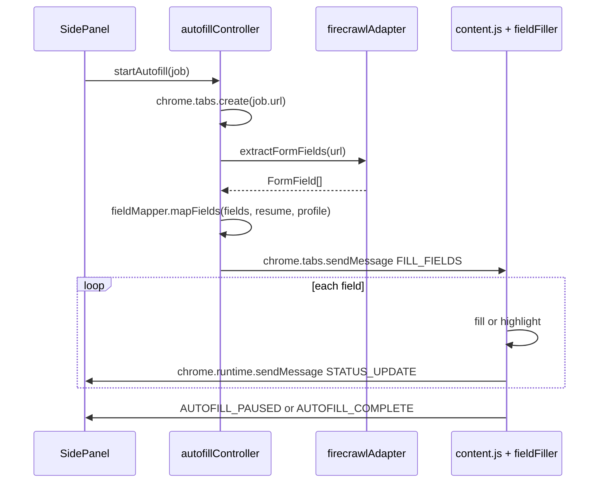

# Firecrawl-Powered Single-Page Form Autofill

## Architecture

All new files live under `src/` alongside existing modules. The UI is a **side panel** (not a popup), so the autofill control bar renders as a new route `#/autofill` in the existing hash router.




## File Map (new and modified)

**New files:**

- `src/config/firecrawl.config.js` -- API key, base URL, USE_MOCK flag
- `src/config/autofill.config.js` -- FILL_DELAY_MS, PAUSE_TRIGGER_KEYWORDS
- `src/modules/scraper/firecrawlAdapter.js` -- raw `fetch` to Firecrawl REST API (scrape + extract), mock mode
- `src/modules/autofill/autofillController.js` -- orchestrates full pipeline (replaces old `src/modules/autofill.js`)
- `src/modules/autofill/fieldMapper.js` -- pure function: FormField[] + resume + profile -> FilledField[]
- `src/modules/autofill/fieldFiller.js` -- content-script-side sequential DOM filler, imported by content.js
- `src/sidepanel/pages/autofillPage.js` -- new route for autofill control bar UI
- `src/sidepanel/components/autofillPanel.js` -- pause/resume/skip buttons + status indicator

**Modified files:**

- [src/content/content.js](src/content/content.js) -- import `fieldFiller.js`, handle new message types (`FILL_FIELDS` with FilledField array, `RESUME_AUTOFILL`, `SKIP_FIELD`), send `AUTOFILL_STATUS` / `AUTOFILL_PAUSED` / `AUTOFILL_COMPLETE` back
- [src/background/service-worker.js](src/background/service-worker.js) -- clean up stale TODO stubs; the side panel handles orchestration directly, so the service worker just relays content-script messages if the side panel isn't the direct listener
- [src/sidepanel/app.js](src/sidepanel/app.js) -- add `#/autofill` route pointing to `renderAutofillPage`
- [src/sidepanel/pages/detailPage.js](src/sidepanel/pages/detailPage.js) -- add "Start Autofill" button that calls `startAutofill(job)` and navigates to `#/autofill`
- [src/modules/storage.js](src/modules/storage.js) -- add `AUTOFILL_STATE` key + typed accessors for autofill session state (tabId, fields, currentIndex, status)
- [manifest.json](manifest.json) -- add `host_permissions: ["https://api.firecrawl.dev/*"]` for Firecrawl API calls; add `"tabs"` permission
- [vite.config.js](vite.config.js) -- no changes needed; `fieldFiller.js` is imported by the existing `content/content.js` entry point so Vite bundles it automatically
- `src/modules/autofill.js` -- delete (superseded by `autofillController.js`)

## Implementation Details by Step

### Step 1: Config files

`**src/config/firecrawl.config.js`:**

```javascript
export const FIRECRAWL_API_KEY = '';
export const FIRECRAWL_BASE_URL = 'https://api.firecrawl.dev/v1';
export const USE_MOCK = true;
```

`**src/config/autofill.config.js`:**

```javascript
export const FILL_DELAY_MS = 400;
export const PAUSE_TRIGGER_KEYWORDS = [
  'essay', 'cover letter', 'salary', 'compensation', 'expected pay',
  'desired salary', 'security clearance', 'nda', 'work location preference',
];
```

### Step 2: firecrawlAdapter.js (with mock mode)

Location: `src/modules/scraper/firecrawlAdapter.js`

Two exported functions:

- `scrapePageContent(url)` -- calls `POST /v1/scrape` with `formats: ["markdown", "html"]`, returns `{ markdown, rawHtml, metadata }`
- `extractFormFields(url)` -- calls `POST /v1/extract` with a JSON schema describing `FormField` shape, returns `FormField[]` where each has `{ label, fieldType, selector, isRequired, suggestedDataKey }`

When `USE_MOCK` is true, both functions return hardcoded realistic data (a mock form with ~12 fields covering name, email, phone, experience, education, sponsorship, salary, cover letter textarea).

### Step 3: fieldMapper.js (pure function)

Location: `src/modules/autofill/fieldMapper.js`

`mapFields(formFields, resume, userProfile) -> FilledField[]`

Mapping strategy:

- Build a lookup from `suggestedDataKey` to resume/profile paths (e.g. `"firstName"` -> `resume.contact.name.split(' ')[0]`, `"email"` -> `resume.contact.email`, `"commonAnswers.sponsorship"` -> `userProfile.sponsorship`)
- For each FormField, check if `suggestedDataKey` resolves to a value; if yes, status `"ready"`
- Check label against `PAUSE_TRIGGER_KEYWORDS` via fuzzy match; if hit, status `"pause_required"`
- Otherwise, status `"skipped"`

### Step 4: autofillController.js

Location: `src/modules/autofill/autofillController.js`

`startAutofill(job)` orchestrates:

1. Store job + URL in autofill session state via storage
2. `chrome.tabs.create({ url: job.url })` -- capture `tabId`
3. Wait for tab `status === 'complete'` via `chrome.tabs.onUpdated`
4. Call `extractFormFields(job.url)` from firecrawlAdapter
5. Load resume + userProfile from storage
6. Call `mapFields(formFields, resume, userProfile)`
7. Store FilledField array and currentIndex in session state
8. Send `{ type: 'FILL_FIELDS', fields: readyAndPauseFields }` to content script via `chrome.tabs.sendMessage(tabId, ...)`
9. Listen for `chrome.runtime.onMessage` for status updates from content script

Also exports `resumeAutofill(tabId)` and `skipField(tabId)` which send corresponding messages to the content script.

### Step 5: content.js + fieldFiller.js

`**src/modules/autofill/fieldFiller.js**` exports:

- `fillFieldSequentially(fields, delayMs)` -- async generator/loop that iterates `FilledField[]`, fills "ready" fields with a delay, highlights + pauses on "pause_required" fields, skips "skipped" fields; sends status messages via `chrome.runtime.sendMessage`
- `highlightField(selector)` / `unhighlightField(selector)` -- adds/removes a CSS outline on the target element
- `setFieldValue(selector, value)` -- sets value, dispatches `input`/`change` events for React/Angular form binding

`**src/content/content.js**` updated message handler:

- `FILL_FIELDS` -- calls `fillFieldSequentially(message.fields, message.delayMs)`
- `RESUME_AUTOFILL` -- resolves a stored Promise to continue the loop
- `SKIP_FIELD` -- resolves the stored Promise with a skip signal

### Step 6: autofillPanel.js + autofillPage.js

`**src/sidepanel/pages/autofillPage.js**` -- new route rendered at `#/autofill`, contains the autofill panel component and listens for `chrome.runtime.onMessage` for status updates from the content script.

`**src/sidepanel/components/autofillPanel.js**` -- renders:

- Status line: `Scanning page...` / `Filling fields (3 of 12)...` / `Paused -- complete this field manually, then resume` / `Page complete -- click Next when ready`
- Pause/Resume button (toggles based on state)
- Skip button (visible only when paused)
- Back to Detail button

The existing [src/sidepanel/components/pauseBanner.js](src/sidepanel/components/pauseBanner.js) will be subsumed by the new autofillPanel; it can be left in place for backward compatibility or removed.

### Wiring Changes

- **[manifest.json](manifest.json):** Add `"host_permissions": ["https://api.firecrawl.dev/*"]` and `"tabs"` to permissions
- **[src/sidepanel/app.js](src/sidepanel/app.js):** Add `'#/autofill': renderAutofillPage` to routes
- **[src/sidepanel/pages/detailPage.js](src/sidepanel/pages/detailPage.js):** Add a "Start Autofill" button below the existing "Back to Results" button that triggers `startAutofill(job)` and navigates to `#/autofill`
- **[src/modules/storage.js](src/modules/storage.js):** Add `AUTOFILL_STATE: 'jobbot_autofillState'` key with `getAutofillState()` / `setAutofillState()` accessors
- **Delete** `src/modules/autofill.js` (superseded by `src/modules/autofill/autofillController.js`)

### TODO markers for future work

Each file will include `// TODO:` comments at points where these future features plug in:

- Multi-page support (detecting "Next" buttons and continuing across pages)
- Account creation detection (login/signup forms before the application)
- LLM-based field inference (replacing keyword matching in fieldMapper with AI)
- LLM-based value generation for essay/cover letter fields

